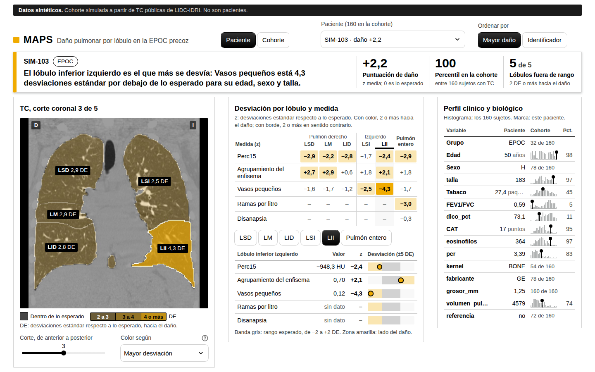
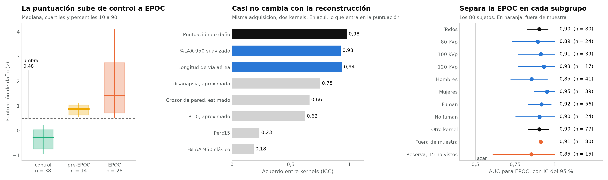

# MAPS: mapa del daño pulmonar en la EPOC precoz

**Proyecto ganador del reto 3 de la [Respira Hackathon](https://respira-hackathon.devpost.com)**
(Barcelona, 1 a 3 de octubre de 2026).

**[Ver las diapositivas y la aplicación →](https://nicorosaless.github.io/maps/)**

La EPOC se diagnostica con una espirometría, y la definición de lo que viene
antes, la pre-EPOC, sigue en debate. MAPS mide en la TC dos cosas que dan lo
mismo con dos reconstrucciones de la misma imagen: cuánto enfisema hay y cuánto
árbol bronquial se ve. Compara cada una con lo esperado para alguien de la misma
edad, sexo, talla y hábito de tabaco, y con eso y la espirometría clasifica a
cada persona como control, posible pre-EPOC o EPOC, diciendo por qué.



*Las diapositivas y la aplicación publicadas usan sujetos simulados sobre TC
públicas de LIDC-IDRI. Las cifras son los agregados reales de la cohorte del
reto. No hay datos de pacientes en este repositorio.*

## Lo que encontramos

- **Dos medidas de la TC reproducen la espirometría.** AUC de 0,91 para separar
  EPOC de control en personas que el modelo no vio; la correlación con el
  FEV1/FVC pasa de 0,17 con la clínica sola a 0,73 con la TC.
- **Un poco de clínica ayuda; más medidas, no.** Con edad, sexo, talla, IMC y
  tabaco, el AUC sube a 0,95. Con síntomas, DLCO y FENO baja a 0,90, y con las
  27 medidas de TC y pesos aprendidos, a 0,85.
- **Es una medida objetiva.** La puntuación da lo mismo con los dos filtros de
  reconstrucción del escáner (ICC de 0,98), frente a 0,18 del %LAA-950 clásico.
- **14 posibles pre-EPOC.** Sin obstrucción y con una TC que se parece a la de
  la EPOC; 13 de ellos tienen el cociente normal también con los valores de
  referencia GLI-2012. Que la TC se adelante a la espirometría no está
  demostrado: hace falta seguir a la cohorte.
- **El tabaco.** Dentro de la EPOC, la TC está más alterada en quien fumó menos
  (−0,58). Es compatible con una susceptibilidad de la vía aérea (disanapsia),
  y no lo podemos distinguir de que los más graves fumaran menos.

## Cómo funciona

1. **Segmentar.** [TotalSegmentator](https://github.com/wasserth/TotalSegmentator)
   separa los cinco lóbulos, la vía aérea, las arterias y las venas.
2. **Medir.** De cada TC salen 27 medidas: enfisema, densidad, grosor de pared
   bronquial, Pi10, disanapsia, longitud y ramas del árbol bronquial, vasos.
3. **Comparar con lo esperado.** Un modelo ajustado solo con el grupo de
   referencia predice cada medida a partir de la edad, el sexo, la talla, el
   volumen pulmonar, el tabaquismo activo y el kVp. El resultado es la
   desviación de esa predicción, en desviaciones estándar.
4. **Puntuar y clasificar.** La puntuación de daño es la media de dos
   desviaciones: %LAA-950 suavizado y longitud de vía aérea. EPOC si FEV1/FVC es
   menor de 0,70; posible pre-EPOC si no hay obstrucción pero la TC se parece a
   la de la EPOC; control en otro caso.
5. **Validar.** Controles negativos, la misma TC con otro kernel, estratos por
   kVp, sexo y tabaco, y una escalera de evidencia en sujetos que el modelo no
   ha visto.

No hay ninguna etiqueta de enfermedad en los pasos 1 a 3. La única red neuronal
es la de segmentación, que viene preentrenada. El detalle y la justificación de
cada pieza están en [docs/modelo.md](docs/modelo.md).

## Resultados

Con los datos del reto: 80 sujetos con TC, 28 con EPOC y 52 sin obstrucción.



| | Modelo final, fuera de muestra (80) | Primera prueba, en reserva (15) |
|---|---|---|
| Relación con FEV1/FVC (Spearman) | -0,73, IC de -0,83 a -0,57 | -0,81 |
| La misma, entre quienes no tienen obstrucción | -0,34, p = 0,016 | |
| Separa EPOC de control (AUC) | 0,91 | 0,85, IC de 0,61 a 1 |
| Acuerdo entre dos reconstrucciones (ICC) | 0,98; el %LAA-950 clásico, 0,18 | 0,99 |

- "Fuera de muestra" es validación cruzada anidada: cada sujeto se puntúa con un
  modelo que no lo vio para ajustar lo esperado, elegir medidas ni fijar el umbral.
- La longitud de las vías de menos de 3 mm de luz sigue al FEV1/FVC más que la
  de las vías de 3 mm o más (diferencia de 0,36 entre sus correlaciones, IC de
  0,10 a 0,60).
- Clases: 38 control, 14 posible pre-EPOC y 28 EPOC.
- La puntuación se lee de dos maneras: en la EPOC va con la gravedad (disnea, DLCO, enfisema visual); en quien no tiene obstrucción va con unas vías centrales estrechas para su pulmón, y no con el tabaco. Es exploratorio.

Lo que no demuestra: que la TC vea una enfermedad que la espirometría no ve. Los
controles que marca están más cerca de la obstrucción (FEV1/FVC de 0,75 frente a
0,78), pero no detectamos diferencias en síntomas ni en evolución.

Todas las cifras, con lo que no sale, en [docs/resultados.md](docs/resultados.md)
y resumidas en [docs/cifras.md](docs/cifras.md).

## Las diapositivas y la aplicación

Están en `web/` (Next.js, sitio estático) y se compilan sin nada externo: la
cohorte simulada y las TC públicas van en `web/public/`.

```bash
cd web
pnpm install
pnpm dev                                   # http://localhost:3000
pnpm build                                 # sitio estático en out/
NEXT_PUBLIC_BASE_PATH=/maps pnpm build     # para publicarlo en una subcarpeta
```

`web/scripts/make_fixture.py` regenera esa cohorte simulada a partir de las TC
de LIDC-IDRI, y `scripts/export_web.py` escribe el mismo formato con una
cohorte real, sin sacarla de donde esté.

## Puesta en marcha

Necesitas Linux x86_64, [uv](https://docs.astral.sh/uv/) y unos 12 GB de disco.
Una GPU NVIDIA acorta la segmentación de 12 minutos a 90 segundos por TC.

```bash
./mn5/build_bundle.sh      # Python 3.12 autónomo con todas las dependencias, en bundle/
./mn5/fetch_weights.sh     # pesos de los modelos, dentro de bundle/
source mn5/env.sh          # activa ese Python, sin conexión
python3 -m pytest -q       # 89 tests
```

`bundle/` es el mismo entorno que se copia a MareNostrum, donde los nodos no
tienen internet. Los pasos para subirlo y lanzar los trabajos están en
[mn5/README.md](mn5/README.md).

## Probar sin datos del reto

```bash
./scripts/fetch_data.sh lidc                                   # 4 TC públicas, 520 MB
for id in 0002 0004 0009 0010; do
  python3 scripts/extract_subject.py data/lidc/LIDC-IDRI-$id --id LIDC-$id --out outputs/cohorte
done
python3 scripts/collect_cohort.py outputs/cohorte
python3 scripts/simulate_cohort.py outputs/cohorte --out outputs/simulada
python3 scripts/score_cohort.py mn5/cohorte.simulada.toml
python3 -m streamlit run app/maps_app.py --server.headless true \
  --browser.gatherUsageStats false -- --cohort outputs/simulada
```

La app queda en `http://localhost:8501`.

La cohorte simulada remuestrea las medidas reales de esas cuatro TC y les añade
efectos conocidos. Sirve para comprobar que el análisis recupera lo que se ha
puesto. No es un resultado.

## Procesar una cohorte

```bash
python3 scripts/inventory.py <datos> --out outputs/inventario.csv
python3 scripts/make_manifest.py outputs/inventario.csv --out outputs/manifiesto.csv
python3 scripts/extract_subject.py <carpeta> --id <id> --out outputs/cohorte
python3 scripts/collect_cohort.py outputs/cohorte
cp mn5/cohorte.ejemplo.toml mn5/cohorte.toml      # y edita los nombres de columna
python3 scripts/score_cohort.py mn5/cohorte.toml
```

| Script | Qué hace |
|---|---|
| `inventory.py` | Lista cada serie DICOM con su kernel, grosor, fabricante y dosis. Ejecútalo primero: dice qué protocolos hay y cuántas series tiene cada paciente |
| `make_manifest.py` | Elige una serie por paciente |
| `extract_subject.py` | Segmenta una TC, mide cada lóbulo y guarda la vista previa. En MareNostrum se lanza como job array con `mn5/extract_array.sbatch` |
| `qa_subject.py` | Dibuja los lóbulos, la vía aérea y los vasos de una TC para revisar la segmentación |
| `collect_cohort.py` | Junta las tablas de todos los sujetos |
| `score_cohort.py` | Calcula las desviaciones, la puntuación de daño, la escalera de evidencia y los controles negativos |

`mn5/cohorte.toml` recoge las cuatro decisiones que dependen de los datos: qué
columna identifica al sujeto, quién es de referencia, qué covariables entran en
el ajuste y cuál es el objetivo de la escalera.

## Qué se mide

| Familia | Medidas | Qué cambia en la enfermedad precoz |
|---|---|---|
| Densidad | Perc15, %LAA-950, %LAA-910, densidad media, masa | Se pierde tejido |
| Patrón | Agrupamiento de los vóxeles de baja densidad | El enfisema forma focos y el ruido no |
| Vasos | Fracción del volumen vascular en vasos pequeños, total y arterial | Se pierden los vasos distales |
| Vía aérea | Ramas visibles, ramas por litro, longitud, disanapsia, fracción de pared | Se pierden las ramas pequeñas |

Las medidas de vía aérea se dan para el pulmón entero y las demás por lóbulo.
La puntuación de daño de un sujeto es la media de sus desviaciones, con una
medida por familia para no contar la densidad varias veces.

## Cómo se valida

No hay etiqueta de pre-EPOC, así que lo que se valida es la puntuación: si
sigue la limitación al flujo aéreo, que no sale de la imagen, en sujetos que el
modelo no ha visto.

- **Primero, una reserva.** Con 62 sujetos se cerró un modelo y se probó una
  sola vez en 15 que no había visto, con los criterios escritos antes
  (`docs/protocolo-reserva.md`).
- **Después, todos los sujetos.** El modelo final se ajusta con los 80 y se
  valida con validación cruzada anidada, que repite en cada vuelta el ajuste, la
  elección de medidas y el umbral (`docs/protocolo-mejora.md`).
- **Controles negativos.** Si la puntuación distingue el sexo, el tabaco o el
  kVp dentro de los controles, está midiendo otra cosa.
- **Estabilidad.** La misma TC con otro kernel debe dar la misma puntuación.
- **Calidad de imagen.** No debe seguir el ruido, el tamaño del píxel ni el paso de corte.
- **Referencia sin fuga.** Cada sujeto de referencia recibe su desviación de un
  modelo ajustado con todos los demás.
- **Escalera de evidencia.** Qué añade la TC a la clínica, en validación cruzada
  y en la reserva.

## Estructura

```
app/                    app de demostración en Streamlit
web/                    diapositivas y plataforma en Next.js
mn5/                    entorno autónomo, Slurm y configuración de la cohorte
scripts/                pasos del flujo, uno por fichero
tests/                  tests de comportamiento
docs/                   modelo, resultados, protocolos y experimento previo

src/maps/ct.py          lectura de DICOM y NIfTI a unidades Hounsfield
src/maps/dicom_meta.py  cabeceras DICOM: kernel, grosor, dosis, fabricante
src/maps/anatomy.py     lóbulos, vía aérea, arterias y venas con TotalSegmentator
src/maps/qct.py         densitometría, masa y agrupamiento del enfisema
src/maps/airways.py     ramas, longitud, calibre y disanapsia del árbol bronquial
src/maps/vessels.py     fracción del volumen vascular en vasos pequeños
src/maps/geometry.py    distancias en milímetros sobre máscaras
src/maps/features.py    tabla de medidas por región y vista previa coronal
src/maps/normative.py   desviación de cada medida respecto a la referencia
src/maps/cohort.py      unión con la tabla clínica y puntuación de daño
src/maps/validation.py  escalera de evidencia y controles negativos
```

## Documentación

- [docs/datos-reto.md](docs/datos-reto.md) describe los datos reales del reto: la tabla
  clínica, las TC y sus trampas.
- [mn5/README.md](mn5/README.md) explica cómo trabajar en MareNostrum sin
  internet.
- [app/README.md](app/README.md) explica cómo arrancar la app y verla por un
  túnel SSH.
- [web/README.md](web/README.md) explica las diapositivas y la plataforma web.
- [docs/experimento-resnet.md](docs/experimento-resnet.md) cuenta por qué
  descartamos los embeddings de una ResNet: empatan con un índice clásico de
  densidad.

## Datos y licencias

El repositorio no contiene datos de pacientes, pesos ni salidas. Los datos del
reto se quedaron en MareNostrum durante la hackathon y no se descargaron.

- TC públicas de [LIDC-IDRI](https://doi.org/10.7937/K9/TCIA.2015.LO9QL9SX),
  licencia CC BY 3.0. Aparecen en las capturas de `app/screenshots/` y en
  `web/public/`.
- [Base de enfisema](https://lauge-soerensen.github.io/emphysema-database/) de
  Sørensen et al. (2010), para investigación y sin redistribución. Solo la usa
  el experimento previo.
- TotalSegmentator y lungmask, licencia Apache-2.0.

## Cómo se hizo

Lo hicimos en dos días con ayuda de asistentes de IA (Claude y Codex) para
escribir código, revisar el análisis y redactar. Las decisiones del análisis
(qué medir, cómo validar, qué contar y qué no) y los criterios de la reserva,
escritos antes de mirarla, son del equipo.
